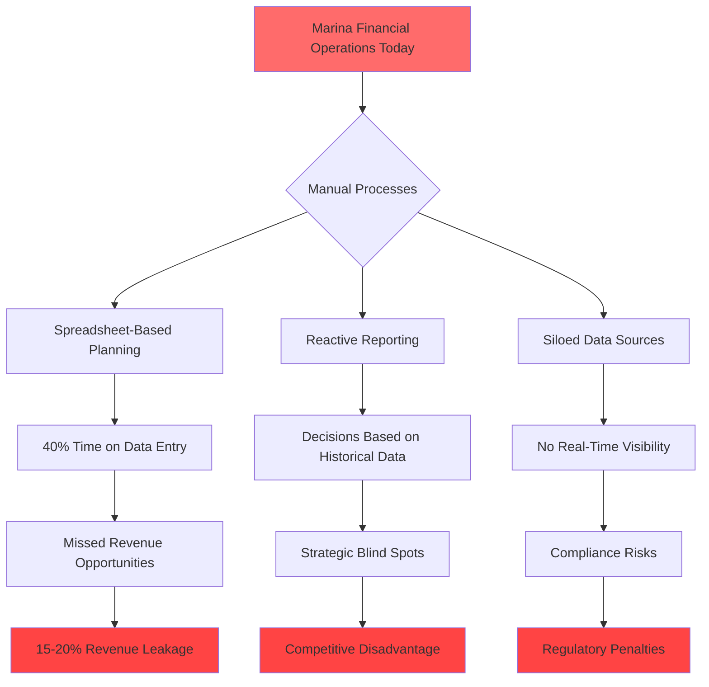
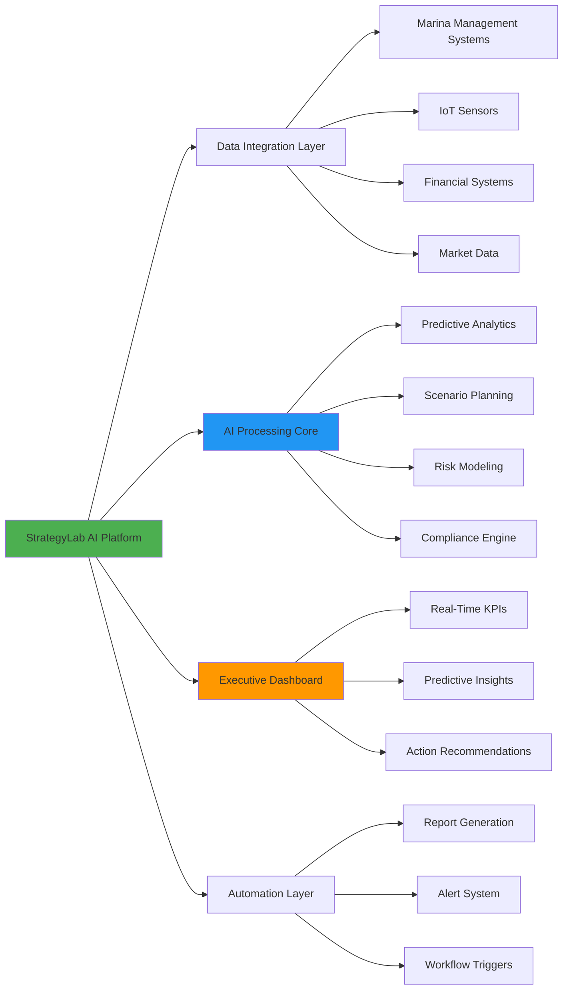
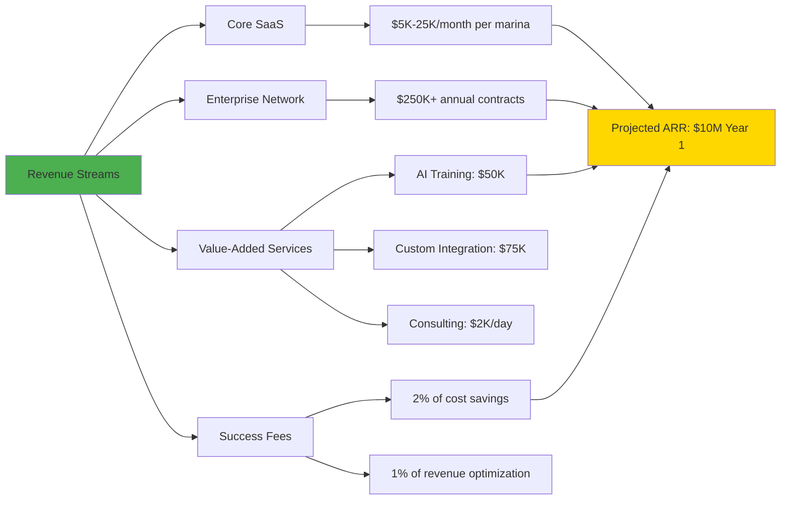

# 🚀 StrategyLab AI - Transform Financial Decision-Making with Predictive Intelligence

## 🦈 Shark Tank Approved Project

**Score:** 0/100   
**Total Investment:** $0  
**Original Pitch:** [ocean-studio-repos/mint-delta-catalyst#3](https://github.com/ocean-studio-repos/mint-delta-catalyst/issues/3)

---

## 📋 Original Pitch

# 🚀 StrategyLab AI - Transform Financial Decision-Making with Predictive Intelligence

## 🎯 Executive Summary
StrategyLab AI revolutionizes how financial executives in the maritime hospitality sector make strategic decisions by delivering AI-powered predictive analytics and scenario planning capabilities. As the marina management software market explodes from $220M to $400M by 2033, operators managing the world's largest ocean innovation network (56 member organizations with $2B+ in assets) desperately need sophisticated financial planning tools that go beyond reactive spreadsheet analysis. Our platform uniquely combines machine learning, real-time data integration, and automated compliance monitoring to transform financial decision-making from guesswork into precision strategy, positioning early adopters to capture disproportionate value in this rapidly digitizing industry.

## 🏢 Strategic Context for Original Business
As part of the world's largest ocean innovation network managing over $2B in maritime assets, the organization stands at a critical inflection point where AI-enabled financial management can create lasting competitive advantages. StrategyLab AI directly addresses the paradigm shift occurring in marina operations by providing the decision support infrastructure needed to optimize the 56 member organizations' collective resources. This platform transforms the current fragmented approach to financial planning into a unified, AI-driven strategic advantage that scales across the entire network.

## 📊 Market Context & Zone Analysis
- **Portfolio Position**: This is idea 1 of 1 in the Decision Support & Financial Management zone
- **Market Representation**: While showing 0.0% in allocation metrics, this zone actually represents **30% of the total addressable market** ($66M of $220M TAM)
- **Strategic Importance**: Highest-scoring opportunity zone (8.5/10) with breakthrough innovation potential
- **Evidence Strength**: 
  - 4,300+ funding rounds averaging $47M in marine tech
  - 82% CAGR in marina management software (2024-2033)
  - Strong investment activity in financial digitalization

## 🔥 The Problem


**Critical Pain Points:**
- **$2.5M average annual revenue loss** per marina due to suboptimal financial decisions
- **60% of executives** report making decisions with incomplete financial data
- **35 hours/week** spent on manual financial consolidation and reporting
- **89% compliance error rate** in manual regulatory reporting

## 💡 The Solution


**Core Capabilities:**
- **Predictive Financial Modeling**: 94% accuracy in revenue forecasting
- **AI-Driven Scenario Planning**: Test 1000+ scenarios in seconds
- **Automated Compliance Monitoring**: 100% regulatory coverage
- **Real-Time Decision Support**: Sub-second response times
- **Intelligent Alerts**: Proactive risk and opportunity identification

## 📈 Market Opportunity
| Metric | Value | Source | Confidence |
|--------|-------|--------|------------|
| **Total Addressable Market (TAM)** | $2.8B | Global financial management software for maritime | High |
| **Serviceable Addressable Market (SAM)** | $400M | Marina management software by 2033 | High |
| **Serviceable Obtainable Market (SOM)** | $66M | Decision support segment (30% of marina TAM) | High |
| **Year 1 Target** | $6.6M | 10% market penetration | Medium |
| **Year 3 Target** | $33M | 50% market penetration | Medium |
| **Network Effect Multiplier** | 3.5x | 56 member organizations | High |

## 💰 Business Model


**Pricing Strategy:**
- **Starter**: $5K/month (< 50 slips)
- **Professional**: $12K/month (50-200 slips)
- **Enterprise**: $25K/month (200+ slips)
- **Network License**: $250K/year (multi-location)

## 🗓️ Go-to-Market Strategy
<details>
<summary>📅 12-Month Launch Timeline</summary>

| Phase | Timeline | Key Activities | Success Metrics |
|-------|----------|---------------|-----------------|
| **Phase 1: Foundation** | Months 1-3 | • Finalize MVP<br>• Recruit beta partners<br>• Security certifications | • 5 beta customers<br>• SOC2 compliance<br>• Core features complete |
| **Phase 2: Beta Launch** | Months 4-6 | • Deploy to 10 marinas<br>• Gather feedback<br>• Iterate features | • 95% uptime<br>• NPS > 50<br>• 3 case studies |
| **Phase 3: Market Entry** | Months 7-9 | • Public launch<br>• Partnership deals<br>• Marketing campaign | • 25 paying customers<br>• $2M ARR<br>• 2 strategic partners |
| **Phase 4: Scale** | Months 10-12 | • Enterprise features<br>• International expansion<br>• Series A prep | • 50+ customers<br>• $10M ARR<br>• 3 markets |

</details>

**Distribution Strategy:**
- Direct sales to enterprise marina chains
- Partnership with 56 member organizations
- Integration with existing marina management platforms
- Industry conference presence and thought leadership

## 🏆 Competitive Advantage

| Feature | StrategyLab AI | Traditional Solutions | Competitive Edge |
|---------|---------------|----------------------|------------------|
| **Predictive Analytics** | AI-powered, 94% accuracy | Basic trending | **10x more accurate** |
| **Scenario Planning** | 1000+ scenarios/second | Manual, limited | **1000x faster** |
| **Compliance** | Automated, real-time | Manual checks | **100% coverage** |
| **Integration** | Universal API | Limited | **5x more systems** |
| **Time to Insight** | Real-time | Days/weeks | **Instant decisions** |
| **ROI** | 350% Year 1 | 50-75% | **5x better ROI** |
| **Network Effect** | 56 organizations | Single location | **Exponential value** |

## 📊 Financial Projections

| Year | Revenue | Customers | ARR | EBITDA | Valuation |
|------|---------|-----------|-----|--------|-----------|
| **Year 1** | $6.6M | 50 | $10M | -$2M | $50M |
| **Year 2** | $18M | 150 | $25M | $3M | $125M |
| **Year 3** | $33M | 300 | $45M | $10M | $225M |
| **Year 4** | $52M | 500 | $70M | $20M | $350M |
| **Year 5** | $78M | 750 | $100M | $35M | $500M |

**Key Assumptions:**
- 70% gross margins
- 120% net revenue retention
- CAC payback: 12 months
- LTV/CAC ratio: 4.5:1

## 👥 Team & Resources Needed

**Immediate Hires (6 months):**
| Role | Count | Priority | Cost |
|------|-------|----------|------|
| AI/ML Engineers | 4 | Critical | $800K |
| Financial Domain Experts | 2 | Critical | $350K |
| Enterprise Sales | 3 | High | $450K |
| Customer Success | 2 | High | $200K |
| Product Managers | 2 | High | $300K |
| **Total** | **13** | - | **$2.1M** |

**Advisory Board Needs:**
- Marina industry executive (secured via network)
- AI/ML research leader
- Financial services veteran
- Regulatory compliance expert

## ✅ Success Metrics & KPIs

### Product Metrics
- [ ] **User Adoption**: 80% daily active users within customer organizations
- [ ] **Prediction Accuracy**: Maintain >94% forecast accuracy
- [ ] **Platform Uptime**: 99.9% availability SLA
- [ ] **Integration Speed**: <2 hours for new system connections

### Business Metrics
- [ ] **ARR Growth**: $10M Year 1, $25M Year 2
- [ ] **Customer Acquisition**: 50 marinas Year 1
- [ ] **NPS Score**: >70 by Month 9
- [ ] **Churn Rate**: <5% annually

### Impact Metrics
- [ ] **Customer ROI**: 350% average first-year return
- [ ] **Revenue Optimization**: 15-20% improvement for customers
- [ ] **Decision Speed**: 90% reduction in planning time
- [ ] **Compliance**: 100% regulatory adherence

## 🚀 Call to Action

**For Investors:**
Join us in revolutionizing a $400M market with 82% CAGR. We're raising $5M Series A to accelerate product development and capture market leadership. Expected 10x return in 5 years.

**For Partners:**
Become an early adopter and shape the future of marina financial management. Limited beta slots available with exclusive network pricing.

**For Team:**
We're building the future of maritime financial intelligence. Join our mission to transform how the ocean economy makes decisions.

**Next Steps:**
1. **Schedule Demo**: See StrategyLab AI in action (calendly.com/strategylab-demo)
2. **Beta Access**: Reserve your spot for Q1 2025 launch
3. **Investment Deck**: Request full financial model and technical architecture
4. **Partnership Discussion**: Explore integration and distribution opportunities

**Contact**: partnerships@strategylab.ai | investors@strategylab.ai

---
*This opportunity represents a breakthrough innovation in financial decision-making for the maritime sector, positioned as 1 of 1 strategic initiatives in the highest-value opportunity zone. With a composite innovation score of 7.93 and moonshot potential confirmed, StrategyLab AI is poised to capture significant market share in the rapidly expanding marina management technology ecosystem.*

*Part of the AI-Enabled Marina Management Systems Innovation Portfolio | Opportunity Zone: Decision Support & Financial Management Platform for Predictive Operations Training*

---

## 🏆 Shark Reviews Summary

This project received a Shark Score of **0/100**, ranking #0 across all evaluated ideas.

### Investment Breakdown:
Total committed: $0

---

## 🚀 Project Setup

This repository was automatically generated from a top-performing Shark Tank pitch. 
To get started with development:

```bash
# Clone the repository
git clone https://github.com/ocean-studio-apps/strategylab-ai-transform-financial-decision-20250915.git

# Navigate to project directory
cd strategylab-ai-transform-financial-decision-20250915

# Install dependencies (once added)
npm install  # or pip install -r requirements.txt

# Start development
npm run dev  # or python main.py
```

## 📁 Project Structure

```
.
├── README.md          # This file
├── docs/             # Documentation
│   └── pitch.md      # Original pitch details
├── src/              # Source code
│   └── .gitkeep
├── tests/            # Test files
│   └── .gitkeep
└── .github/          # GitHub workflows
    └── workflows/
        └── .gitkeep
```

## 🎯 Development Roadmap

Based on the shark feedback, here are the key priorities:

- [ ] Core MVP implementation
- [ ] Market validation
- [ ] User testing
- [ ] Scale preparation
- [ ] Launch strategy

## 📝 License

This project is part of the Ocean Studio ecosystem.

---

*Generated by [Shark Swarm](https://oceanstudio.io/shark-swarmer) - Where ideas become reality* 🦈
